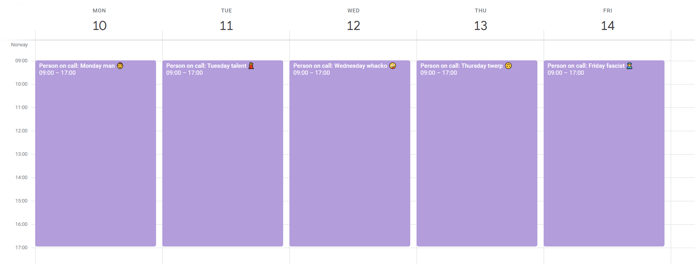

# Slack Calendar Topic

A script that sets the topic of a Slack channel to the currently ongoing event
in a Google calendar. Great for keeping track of who's on call, for example.



## Getting started

#### Create a service account

Create a Google Service Account, download the credentials in JSON format and
export it to `GOOGLE_CREDENTIALS`.

#### Create a Slack bot

Create a Slack bot with scopes `channels:manage` and `channels:read`, and export
its access token to `SLACK_ACCESS_TOKEN`.

#### Share a calendar with your service account

Go to *Settings and sharing* for the Google Calendar you'd like to use.
Share it with the service account by entering the e-mail address of the
service account in *Share with specific people*.

#### Select a channel

Export the ID for the Slack channel you'd like to use to `SLACK_CHANNEL_ID`.

#### Connect the calendars and channels

Create a mapping between calendars and channels like so, and export it to
`CHANNEL_CALENDAR_MAP`:

```json
[
  {
    "calendarId": "c_413612vkasdr1126ckja82sa0v@group.calendar.google.com",
    "channelId": "C018DQTCFNX"
  },
  ...
]
```

## Deploying

#### Anywhere you want

You can deploy this script anywhere that runs Node and has some mechanism for running it on
a schedule (as often as you want to check, basically).

#### AWS Lambda

It's a particularly good fit for Lambda, and a simple deployment script is included in
`deploy.sh`. Run it like so:

```bash
$ AWS_LAMBDA_NAME=slack-calendar-topic ./deploy.sh
```

